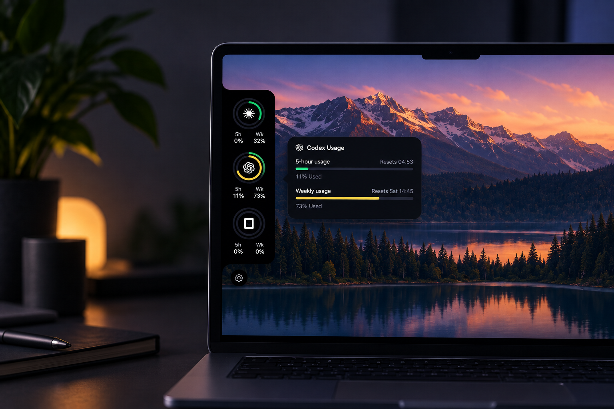

# Token Drain

Token Drain is a small Windows desktop widget that shows usage and rate limits
for Claude, Codex, and OpenCode Go subscriptions at a glance.

The rail stays at the edge of the screen and keeps the provider badges visible
without opening a browser or asking you to paste credentials. It works whether
you use the provider CLIs or only the Claude and Codex desktop apps, and it can
be moved along either screen edge, resized, and switched between dark and light
themes. Data collection details are documented for [Claude](docs/claude.md),
[Codex](docs/codex.md), and [OpenCode Go](docs/opencode.md).

## Download

Download the latest signed updater-enabled Windows installer from the
[latest GitHub release](https://github.com/mauricio-uy/token-drain/releases/latest).
Public releases provide an x64 NSIS installer (`Token Drain_<version>_x64-setup.exe`).
The app is currently supported on Windows 10 version 1809 or later and Windows
11, on x64 systems. WebView2 is required; the installer can bootstrap it when
it is not already present.

Windows may show a SmartScreen warning because public installers are not
Authenticode-signed yet. See the [installation and usage guide](docs/guide.md)
for the warning, credential sources, network hosts, and update behavior.

## Development

Read the [project guide](docs/guide.md) for prerequisites, local commands, and
the release checklist. Contributions are welcome; start with
[CONTRIBUTING.md](CONTRIBUTING.md).

## Project links

[Changelog](CHANGELOG.md) · [Security policy](SECURITY.md) · [Support](SUPPORT.md) ·
[Third-party notices](THIRD_PARTY_NOTICES.md) · [License](LICENSE)

## Status

This is an early release. The provider usage endpoints are undocumented and
may change without notice.

**100% vibe-coded.** The entire project was built through AI-assisted coding,
with tests and release checks kept in the repository for review.
